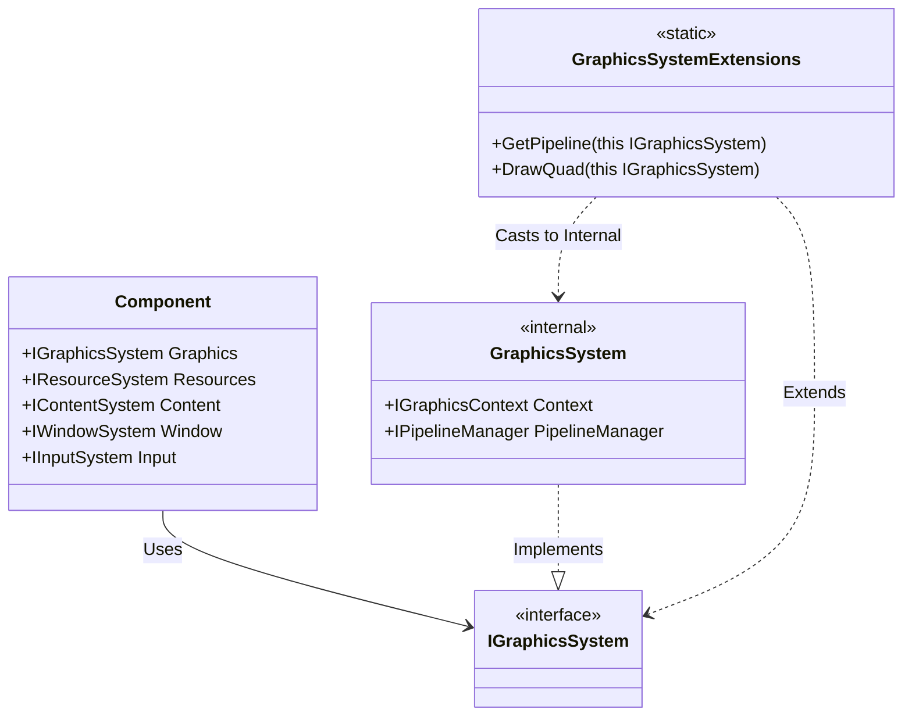

# Systems Architecture Pattern

**Version:** 1.0
**Date:** 2025-05-22

## Overview

The Nexus Game Engine uses a **Systems Pattern** to expose framework capabilities to components and other framework classes. This pattern replaces Constructor Injection and Service Location for accessing core engine services.

## Core Principles

1.  **Marker Interfaces**: Systems are defined by empty marker interfaces (e.g., `IGraphicsSystem`).
2.  **Extension Methods**: Functionality is added to these interfaces via extension methods.
3.  **Property Access**: Classes access systems via properties (e.g., `this.Graphics`).
4.  **Zero Constructor Bloat**: Framework classes do not need to declare dependencies in their constructors.

## Available Systems

| System | Interface | Property | Description |
| :--- | :--- | :--- | :--- |
| **Graphics** | `IGraphicsSystem` | `this.Graphics` | Rendering, pipelines, command buffers, viewports. |
| **Resources** | `IResourceSystem` | `this.Resources` | Textures, meshes, shaders, fonts. |
| **Content** | `IContentSystem` | `this.Content` | Component lifecycle, loading/unloading. |
| **Window** | `IWindowSystem` | `this.Window` | Window size, title, fullscreen, closing. |
| **Input** | `IInputSystem` | `this.Input` | Keyboard, mouse, gamepads. |

## Usage Guide

### 1. Accessing Systems

In any class that inherits from `Component` (or has access to the systems), simply use the property:

```csharp
public class MyComponent : Component
{
    public override void Update(float dt)
    {
        // Input System
        if (Input.IsKeyPressed(Key.Space))
        {
            // Content System
            Content.Load("Explosion");
        }
        
        // Window System
        var size = Window.GetSize();
    }
    
    protected override void OnRender(CommandBuffer cmd)
    {
        // Graphics System
        Graphics.BindPipeline(cmd, _pipeline);
        Graphics.DrawQuad(cmd);
    }
}
```

### 2. Adding Functionality

To add new functionality to a system, create an extension method in the `Nexus.GameEngine.Runtime.Extensions` namespace:

```csharp
namespace Nexus.GameEngine.Runtime.Extensions;

public static class GraphicsSystemExtensions
{
    public static void DrawMySpecialThing(this IGraphicsSystem system, CommandBuffer cmd)
    {
        // Access internal implementation if needed (requires casting)
        var internalSystem = (GraphicsSystem)system;
        internalSystem.Context.VulkanApi.CmdDraw(...);
    }
}
```

### 3. Testing with Mocks

Use `MockSystemHelpers` to create mocked systems for unit tests:

```csharp
[Fact]
public void MyTest()
{
    var mockGraphics = MockSystemHelpers.CreateGraphics();
    
    // Setup expectations
    mockGraphics.PipelineManager.Setup(...);
    
    // Use the system
    var system = mockGraphics.System;
}
```

## Architecture Diagram


