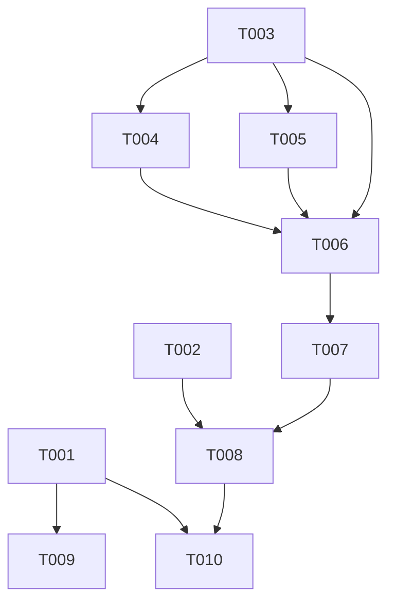

# Tasks: Refactor Entity/Component Lifecycle

**Feature**: Refactor Entity/Component Lifecycle
**Status**: Planned
**Priority**: High

## Phase 1: Setup
**Goal**: Prepare the codebase for lifecycle changes and structural refactoring.
**Independent Test**: Solution builds successfully after namespace changes.

- [ ] T001 Modify `src/GameEngine/GUI/IUserInterfaceElement.cs` to add `void UpdateLayout()` method
- [ ] T002 Move `src/GameEngine/Components/ContentManager.cs` to `src/GameEngine/Runtime/ContentManager.cs` and update namespace to `Nexus.GameEngine.Runtime`

## Phase 2: Foundational
**Goal**: Implement the core lifecycle changes in the base class and source generator.
**Independent Test**: Generated code compiles and follows the new `Configure` pattern.

- [ ] T003 Modify `src/GameEngine/Components/Configurable.cs` to add `Configure(Template)`, seal `Load(Template)`, and implement new lifecycle logic
- [ ] T004 Update `src/SourceGenerators/TemplateGenerator.cs` to generate `Configure` override instead of `OnLoad`
- [ ] T005 Update `src/SourceGenerators/TemplateGenerator.cs` to generate `Load(...)` convenience method that calls `this.Configure(...)`

## Phase 3: Consistent Template Loading (US1)
**Goal**: Ensure `Load(template)` orchestrates the full lifecycle correctly.
**Independent Test**: `ConfigurableTests` pass, verifying property application order and hook timing.

- [ ] T006 [US1] Create `src/Tests/GameEngine/Components/ConfigurableTests.cs` to verify lifecycle order (Configure -> OnLoad)
- [ ] T007 [US1] Update `src/GameEngine/Components/ComponentFactory.cs` to ensure it calls `Load(Template)` and does not activate

## Phase 4: Lifecycle Management Separation (US2)
**Goal**: Separate loading (Factory) from validation and activation (ContentManager).
**Independent Test**: `ContentManager` correctly validates and activates components after loading.

- [ ] T008 [US2] Update `src/GameEngine/Runtime/ContentManager.cs` to implement `Load` with `Validate` and `Activate` steps

## Phase 5: Layout Update Phase (US3)
**Goal**: Ensure layout updates happen before validation.
**Independent Test**: `Element.UpdateLayout` is called when loading via `ContentManager`.

- [ ] T009 [US3] Implement `UpdateLayout` in `src/GameEngine/GUI/Element.cs`
- [ ] T010 [US3] Update `src/GameEngine/Runtime/ContentManager.cs` to call `UpdateLayout` for `IUserInterfaceElement` components

## Phase 6: Polish & Cross-Cutting Concerns
**Goal**: Fix any regressions and ensure clean compilation.

- [ ] T011 Fix compilation errors in `src/GameEngine/GlobalUsings.cs` and other files due to namespace changes
- [ ] T012 Fix any compilation errors resulting from `Load` becoming non-virtual in derived classes

## Dependencies

## Parallel Execution Examples

**US1 (Consistent Template Loading)**
- T006 (Tests) can be written while T003/T004 (Implementation) are in progress.

**US3 (Layout Update)**
- T009 (Element implementation) can be done in parallel with T008 (ContentManager refactor).

## Implementation Strategy
1.  **Setup**: Move files and update interfaces first to establish the structure.
2.  **Core Logic**: Update `Configurable` and `TemplateGenerator` together as they are tightly coupled.
3.  **Verification**: Write tests immediately after core logic to verify the generated code works as expected.
4.  **Integration**: Update `ContentManager` and `ComponentFactory` to use the new lifecycle.
5.  **UI**: Finally, hook up the layout system.
